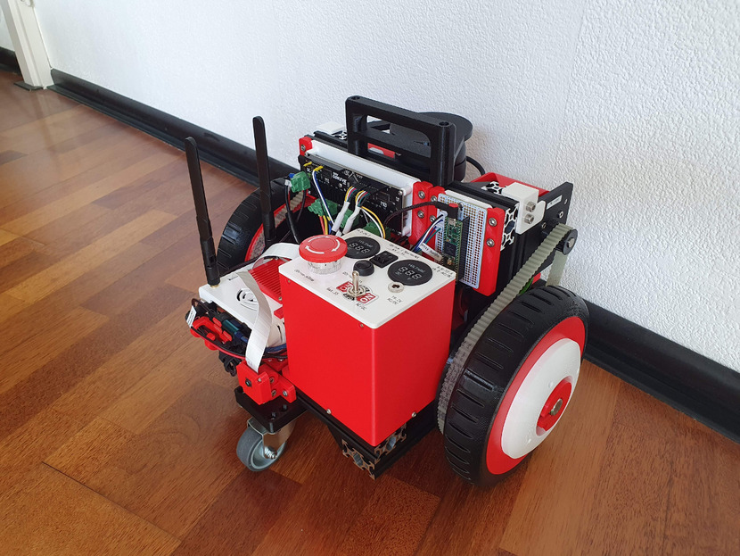
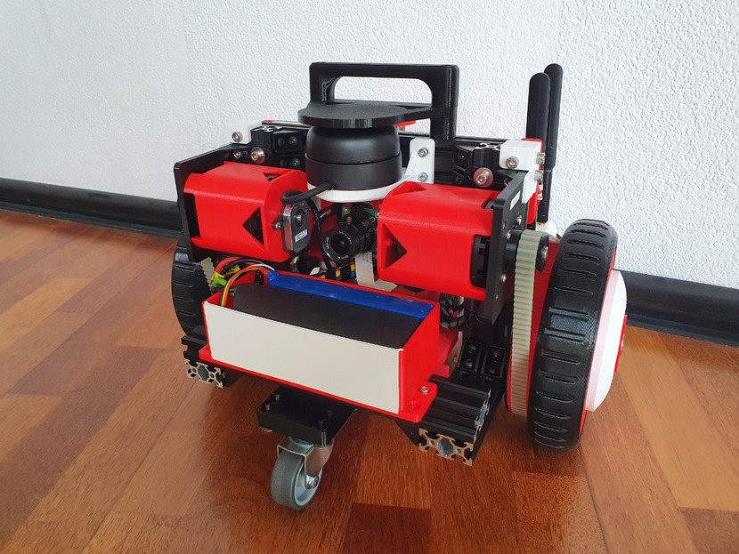

# **3R2 ROS Real Robot v2**

## NOTE 1

This project was brought to light from my private repository. Some of the resources may be obsolete by now, though feel free to reach out if you need any help.

## NOTE 2 

This project was originally forked from James Bruton's Really Useful Robot (March 2021). His GitHub link is [here](https://github.com/XRobots/ReallyUsefulRobot "XRobots/ReallyUsefulRobot on GitHub")


## Images







## Getting Started

### Setup 3R2 repository
```bash
mkdir ~/Repositories
cd ~/Repositories/
git clone https://orosu@bitbucket.org/orosu/3r2_ros_real_robot_v2.git
cd 3r2_ros_real_robot_v2/
vim README.md
```

### Install ODrive
```bash
# Install odrivetool: https://docs.odriverobotics.com/#downloading-and-installing-tools
sudo apt-get update
sudo apt-get upgrade
sudo apt install python3 python3-pip
pip3 install matplotlib # optional
pip3 install --upgrade odrive
sudo bash -c "curl https://cdn.odriverobotics.com/files/odrive-udev-rules.rules > /etc/udev/rules.d/91-odrive.rules && udevadm control --reload-rules && udevadm trigger"

vim ~/.bashrc
######
export PATH=$PATH:~/.local/bin
######
source ~/.bashrc
```

### Configure ODrive
```bash
odrivetool
odrv0.erase_configuration() # resets configuration to the factory defaults

odrv0.axis0.controller.config.vel_limit = 16 # default: 2.0
odrv0.axis1.controller.config.vel_limit = 16 # default: 2.0

odrv0.axis0.motor.config.current_lim = 20 # default: 10.0
odrv0.axis1.motor.config.current_lim = 20 # default: 10.0

# Check the calibration current
odrv0.axis0.motor.config.calibration_current # default: 10.0

# Without this setting, I got the ODRIVE_ERROR_DC_BUS_OVER_REGEN_CURRENT error right after the motor stops
odrv0.config.dc_max_negative_current = -8 # default: -0.009999999776482582

# Use encoder index; index = reference point for that encoder to know where to start to count position.
# When the ODrive powers up, the motor will spin until it finds that index
odrv0.axis0.encoder.config.use_index = True # default: False
odrv0.axis1.encoder.config.use_index = True # default: False

odrv0.save_configuration()

# Run full calibration (only once)
odrv0.axis0.requested_state = AXIS_STATE_FULL_CALIBRATION_SEQUENCE
odrv0.axis1.requested_state = AXIS_STATE_FULL_CALIBRATION_SEQUENCE

# Avoid doing the calibration every time the ODrive powers up
odrv0.axis0.encoder.config.pre_calibrated = True # default: False
odrv0.axis1.encoder.config.pre_calibrated = True # default: False

# Look for the index, there's no way around that
# NOTE Make sure there is enough clearance for the motor to move (max 1 turn)
odrv0.axis0.config.startup_encoder_index_search = True # default: False
odrv0.axis1.config.startup_encoder_index_search = True # default: False

# Play the beep sound every time the ODrive powers up
odrv0.axis0.config.startup_motor_calibration = True # default: False
odrv0.axis1.config.startup_motor_calibration = True # default: False

#NOTE You can switch to idle state
# odrv0.axis0.requested_state = AXIS_STATE_IDLE
# odrv0.axis1.requested_state = AXIS_STATE_IDLE

#NOTE You can switch to closed loop state
# odrv0.axis0.requested_state = AXIS_STATE_CLOSED_LOOP_CONTROL
# odrv0.axis1.requested_state = AXIS_STATE_CLOSED_LOOP_CONTROL

#NOTE You can setup the ODrive to enter the closed loop state
# odrv0.axis0.config.startup_closed_loop_control = True # default: False
# odrv0.axis1.config.startup_closed_loop_control = True # default: False

odrv0.save_configuration()
quit
```

### Install PlatformIO
```bash
# Install PlatformIO: https://docs.platformio.org/en/latest//core/installation.html
#NOTE Don't install it in a python virtual environment, as it's causing issues with ROS packages
python3 -m pip install platformio

pio device list

# Setup udev rules for Teensy: https://www.pjrc.com/teensy/00-teensy.rules
sudo vim /etc/udev/rules.d/00-teensy.rules
sudo udevadm control --reload-rules && sudo udevadm trigger
# Unplug Teensy's USB then plug it back
```

### Setup Consistent USB symlinks
```bash
platformio device list
udevadm info -a -n /dev/ttyUSB0 | less
# Copy kernel id for each device (e.g. 1-2.3:1.0)

# JetsonXavierNX
# USB0 | USB2 => 1-2.1:1.0 | 1-2.3:1.0
# USB1 | USB3 => 1-2.2:1.0 | 1-2.4:1.0

sudo vim /etc/udev/rules.d/24-usb.rules
#######################################
SUBSYSTEMS=="usb", KERNELS=="1-2.1:1.0", SYMLINK+="O_ttyUSB0"
SUBSYSTEMS=="usb", KERNELS=="1-2.2:1.0", SYMLINK+="O_ttyUSB1"
SUBSYSTEMS=="usb", KERNELS=="1-2.3:1.0", SYMLINK+="O_ttyUSB2"
SUBSYSTEMS=="usb", KERNELS=="1-2.4:1.0", SYMLINK+="O_ttyUSB3"
#######################################

# USB0 => ODrive
# USB1 => BNO055
# USB2 => RPLidar
# USB3 => Teensy

sudo udevadm control --reload-rules
sudo reboot

# Test that the symlinks are correct
ls -la /dev/O_*
platformio device list
```

### Install ROS

We are using ROS Noetic on Ubuntu 20.04 (dual boot on Desktop) because the XavierNX's OS is based on Ubuntu 20.04 (September 2022)

[Instructions](http://wiki.ros.org/noetic/Installation/Ubuntu)

```bash
lsb_release -a
sudo sh -c 'echo "deb http://packages.ros.org/ros/ubuntu $(lsb_release -sc) main" > /etc/apt/sources.list.d/ros-latest.list'
sudo apt install vim curl
curl -s https://raw.githubusercontent.com/ros/rosdistro/master/ros.asc | sudo apt-key add -
sudo apt update
sudo apt install ros-noetic-desktop-full
apt search ros-noetic
source /opt/ros/noetic/setup.bash
echo "source /opt/ros/noetic/setup.bash" >> ~/.bashrc
source ~/.bashrc
sudo apt install python3-rosdep python3-rosinstall python3-rosinstall-generator python3-wstool build-essential
sudo rosdep init
rosdep update

# vim ~/.ignition/fuel/config.yaml # change url to https://api.ignitionrobotics.org
```

### Setup ROS

[Instructions](http://wiki.ros.org/ROS/Tutorials/catkin/CreateWorkspace)

```bash
mkdir -p ~/catkin_ws/src/
cd ~/catkin_ws/
catkin_make

source devel/setup.bash
echo "source !/catkin_ws/devel/setup.bash" >> ~/.bashrc
source ~/.bashrc

roscd
cd ../src
ln -s ~/Repositories/3r2_ros_real_robot_v2/ROS/geometry2/ .
ln -s ~/Repositories/3r2_ros_real_robot_v2/ROS/jetson_camera/ .
ln -s ~/Repositories/3r2_ros_real_robot_v2/ROS/ros_imu_bno055/ .
ln -s ~/Repositories/3r2_ros_real_robot_v2/ROS/ros_real_robot_v2/ .
ln -s ~/Repositories/3r2_ros_real_robot_v2/ROS/ros_real_robot_v2_simulations/ .
ln -s ~/Repositories/3r2_ros_real_robot_v2/ROS/rosserial/ .
ln -s ~/Repositories/3r2_ros_real_robot_v2/ROS/rplidar_ros/ .

cd ..
rm -rf build/ .catkin_workspace devel/
catkin_make
source ~/.bashrc
rospack profile

sudo ln -s /usr/include/opencv4/opencv2/ /usr/include/opencv


sudo apt-get install ros-noetic-teleop-twist-keyboard ros-noetic-rosbash ros-noetic-xacro ros-noetic-joint-state-publisher-gui ros-noetic-gmapping ros-noetic-slam-gmapping ros-noetic-map-server ros-noetic-navigation ros-noetic-ros-tutorials ros-noetic-compressed-image-transport ros-noetic-camera-info-manager ros-noetic-rviz-imu-plugin ros-noetic-robot-localization ros-noetic-rosserial-arduino

rosdep update
rosdep install --from-paths . --ignore-src

sudo apt install python3-pip
pip3 install pyyaml rospkg pyserial

#NOTE Only for XavierNX
sudo chmod 777 /dev/O_ttyUSB2 # RPLidar
sudo adduser [USERNAME] dialout
sudo reboot
```

### Run ROS
```bash
# Press small pushbutton to initialise the ODrive

# Run the following in different terminals on the SBC (NVIDIA Jetson Xavier NX)

roscore

roslaunch ros_real_robot_v2_bringup robot.launch

# rosrun teleop_twist_keyboard teleop_twist_keyboard.py
rosrun ros_real_robot_v2_teleop ros_real_robot_v2_teleop_key

rostopic echo /tf

rostopic echo /odom
    # twist.twist.linear.x should be similar to speed in teleop
    # twist.twist.angular.x & y could be used for debugging the pos0 and pos1 from ODrive
    #     (NOTE Check the code on the MainControllerTeensy)
```


### Upload the firmware on the Main Controller (Teensy 4.1)
```bash
cd ~/Repositories/3r2_ros_real_robot_v2/Arduino/MainControllerTeensy/
vim src/main.cpp
pio run --target upload
```
